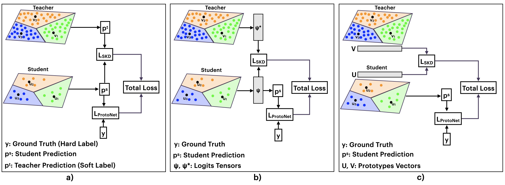

# Enhanced ProtoNet with Self-Knowledge Distillation for Few-Shot Learning
This is the implementation code of [Enhanced ProtoNet with Self-Knowledge Distillation for Few-Shot Learning](https://doi.org/10.1109/access.2024.3472530).

```
@ARTICLE{10703064,
  author={El Hacen Habib, Mohamed and Küçükmanisa, Ayhan and Urhan, Oǧuzhan},
  journal={IEEE Access}, 
  title={Enhanced ProtoNet With Self-Knowledge Distillation for Few-Shot Learning}, 
  year={2024},
  volume={12},
  number={},
  pages={145331-145340},
  keywords={Prototypes;Computational modeling;Training;Predictive models;Few shot learning;Adaptation models;Data models;Feature extraction;Training data;Few shot learning;Metalearning;Few-shot learning;meta-learning;prototypical networks;self-knowledge distillation},
  doi={10.1109/ACCESS.2024.3472530}}
```

In this work, we applied the self-knowledge distillation technique to Prototypical Networks (ProtoNet) to boost its performance. We employed different distillation techniques based on prototypes, logits, and predictions (soft labels).



Parts of this code have been adapted from [Prototypical Networks](https://github.com/jakesnell/prototypical-networks) implementation. 